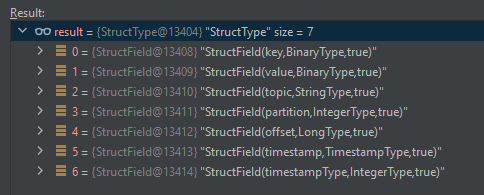

# Astronaut

A project that enables the option of sending data out of the system by using SQL as a complex event processing tool.
The program also has the abilities of debugging a query and specifying exactly why haven't it succeeded.


## Queries and Queues

Astronaut works by the concept of queries and queues.
We will manage pre-defined SQL queries list with properties for each query.
Each query will get built especially for a specific consumer, and will define the destination queue that to results should get written to.
The queue for each query will get defined by name, and Astronaut will manage a list of queues with their credentials.
A user that defined a query and destination queue will receive the results of the query at the queue, after it has been executed on all documents.
The query is an ANSI SQL query. Therefore, it can filter data, and transform the data.


## Readers

The Spark Structured Streaming reader reads data from Kafka in the following format:



## Queries Debugging

When the data is for example:

|  name  | age | job |
|:------:|:---:|:---:|
| George | 30|Developer|

And the required task is to investigate why did this row fail, <br>
so for the SQL statement of
```sql
SELECT * FROM people WHERE name="Ou" AND (age<31 OR age>50)
```
We'd expect the result of the debugging process to be `name="Ou"`, since even though `age>50` failed either, 
the `age<31 OR age>50` statement returned `true`.

In a different example, the query:
```sql
SELECT * FROM people WHERE name="Ou" AND (age<31 OR age>50) AND job="Officer"
```
should result a debugging process that will return `name="Ou"` and `job="Officer"` (these sub-SQL-statement is called a leaf statement), 
since both of them have caused the query to fail. 

Currently, it’s done by recursively iterating all child nodes of the query by the `df.queryExecution.analyzed()` method.
For each node I run it as a `WHERE` clause (e.g. `SELECT * FROM people WHERE name=George`) and I count the returned records to check if that’s passes or not.
`1` means that the query passes, `0` means failure.

### Configuration Options

The debugging process can be configured as following:

`debug-mode`:

A configuration for what should the executor of the debugging process debug.
When specifying `ON_FAILURE`, the program will try to answer the question of "Why did this records failed?" (hence it'll be possible to run this only for failed records).
`ON_SUCCESS` is the exact opposite. 

| Option |             Explanation              |
|:------:|:------------------------------------:|
| ON_FAILURE | Enable debugging for failed records  |
| ON_SUCCESS | Enable debugging for success records |
| NEVER |     Disables the debugging task      |

`debug-accuracy-level`:

A configuration for what accuracy level shall the debugging process be.
When specifying `FIND_KEY_STATEMENT`, the executor search for the exact reason of failure/ success at the SQL tree node.
In case of two failed leaf statements that each of them would lead to the whole statement being passed, Astronaut will return both of them.
e.g. if the statement was `WHERE job="bla" AND (name="George" OR age>50)`.
`name="George"` passed, `age>50` failed, and `job="bla"` failed, then the executor will detect that the key leaf statement here was `job="bla"`.   
`FIND_ALL_UNEXPECTED` will return both `job="bla"` and `name="George"`.
e.g. return all the leaf statements that evaluated the unwanted binary result.

|       Option        |                                                   Explanation                                                   |
|:-------------------:|:---------------------------------------------------------------------------------------------------------------:|
| FIND_KEY_STATEMENT  |     The leaf statements that a different binary result from them would change the whole statement's result.     |
| FIND_ALL_UNEXPECTED | The leaf statements that evaluated the unwanted binary result. Regardless their effect on the whole statement.  |

`debug-depth-level`:

Currently, have not been implemented.

A configuration for what depth should the executor search for at the SQL tree node.
When specifying `LEAF`, 
`HIGHEST_PROBLEMATIC_NODE` . 

| Option |             Explanation              |
|:------:|:------------------------------------:|
| LEAF |   |
| HIGHEST_PROBLEMATIC_NODE |  |


### Limitations

* Debugging exploded documents - After an SQL query has been executed, the document may have been transformed.
  In cases where the document has been exploded, we won't enable debugging, since the debug process currently depends a lot on the count of the results of each sub statement.
